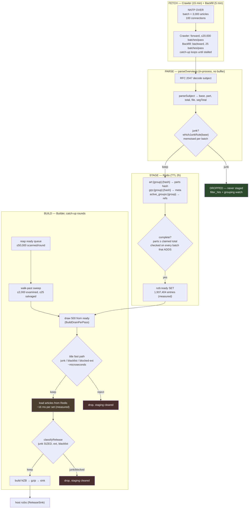

# The article pipeline — flow, buffers, timings, and where the waste is

How an article gets from an NNTP `OVER` response to a stored release, what
holds it at each step, and what each step costs. Numbers marked **(measured)**
come from production on 2026-07-31: a single-box install crawling ~15 groups
over 100 connections, with 2.9 billion articles of backfill queued.

Read this before changing the crawl or build path. The costs are not where they
look.

---

## 1. The flow



---

## 2. Buffers and what bounds them

| Stage | Buffer | Size | Bounded by |
|---|---|---|---|
| Fetch | OVER batch | **3,000 articles** | `batch` |
| Fetch | per pass | 20,000 batches (crawl) / 25 (backfill) | `crawl_max_batches`, `backfill_batches_per_run` |
| Fetch | first pass per group | 20,000 articles | `max_articles_per_group` |
| Parse | none — streamed | — | — |
| Stage | Redis keys | 2 per set + 1 ref | `staging_ttl_hours` = **2h**, `maxmemory` |
| Stage | ready queue | **1.94M entries (measured)** | nothing — it grows |
| Build | draw per round | **500** | `build_drain_per_pass` |
| Build | reap scan | 50,000/round | `ready_reap_per_pass` |
| Build | walk-past | 2,000 examined, 25 salvaged | `walk_past_sweep_per_round` |
| Build | pending sample | 2,000 sets | `pendingSampleCap` |

**The ready queue is the only unbounded buffer**, and on this install it holds
1.94 million entries against a 500-per-round draw. Entries expire with the
staging TTL, so a queue deeper than the drain rate loses completed releases to
the 2-hour clock — counted as `fossil_dropped` in the staging census.

---

## 3. Timings

| Step | Cost | Source |
|---|---|---|
| Crawl cadence | 15 min, catch-up loops within a pass | `crawl_interval_min` |
| Backfill cadence | 5 min | `backfill_interval_min` |
| Backfill throughput | **~36,000 articles/min** | measured |
| Junk check per base | ~microseconds, memoised per batch | measured |
| Title fast-path reject | ~microseconds | design |
| **Article load per set** | **~16 ms** | measured |
| Walk-past grace | 15 min idle before a set is judgeable | `walk_past_grace_min` |
| Staging TTL | 2 h | `staging_ttl_hours` |

---

## 4. Where the waste is

Two problems, both about **when** junk is recognised.

### 4a. Sized rules cannot run at ingest, so junk stages anyway

The junk engine has two tiers: rules that judge on the title alone, and rules
that need the release's **size**. At ingest only the title is known, so
`whichJunkRule(base)` runs the unsized subset. Anything only a sized rule can
catch passes the gate and is staged.

That junk then occupies Redis, completes, joins the ready queue, waits behind
1.94M other entries, gets drawn, gets its articles loaded, and only *then* is
recognised. Measured on 2026-07-31:

```
junk        2,835,142   99.97%     e.g. theta_south_5695f362.dat
built             282    0.01%
```

**2.8 million sets travelled the entire pipeline to be discarded at the last
step.** Yesterday, with the backfill quieter, the same table read 9.4% built.

### 4b. A poster watch disables the title fast path — for everything

The fast path rejects a junk set from its subject in microseconds. It is
disabled whenever ANY poster watch is active, because attribution needs the
articles. With three watches configured, all 2.8M junk sets took the ~16 ms
load: roughly **12.6 hours of CPU spent loading articles that were then thrown
away**. The builder logs the trade, but the cost is invisible unless you
multiply it out.

---

## 5. The fix: estimate the size at ingest

`OVER` already carries per-article `:bytes` (RFC 3977), and `parseSubject`
already yields the claimed part count. So the set's size is estimable **at
ingest**, before anything is staged:

```
estimated_total_bytes ≈ article_bytes × claimed_total_parts
```

That is enough to run the sized rules one stage earlier, moving the 99.97%
rejection from the end of the pipeline to the beginning — before the Redis
write, before the ready queue, before the 16 ms load.

**It must be introduced as an estimate, not a measurement.** A subject claiming
`(1/100)` whose first article is unusually small or large skews the figure, and
a false junk verdict at ingest is unrecoverable — the article is never staged,
so nothing downstream can correct it. Two guards make that safe:

1. **Margin.** Apply a sized rule only when the estimate clears its band by a
   wide factor, so borderline cases fall through to the existing, exact
   judgement at build time. Never tighten a band on an estimate.
2. **Replay before enabling.** `subject_corpus` samples real subjects
   specifically so a grammar or rule change can be replayed old-vs-new and
   diffed rather than reasoned about. The estimate's error distribution is
   measurable from staged sets, where both the estimate and the true total are
   known.

### Why this matters beyond one install

A group like `alt.binaries.boneless` is the hard case this design has to serve:
enormous, majority junk, but with real content mixed in — so blacklisting the
group is not an option and per-article judgement is unavoidable. The cheapest
possible judgement, made at the earliest possible moment, is the only thing
that scales to it.

---

## 6. Other levers, ranked by measured payoff

| Lever | Effect | Cost |
|---|---|---|
| Clear poster watches when not investigating | restores the microsecond fast path for every set | config, instant |
| Size estimate at ingest (§5) | moves 99.97% rejection before staging | code + replay |
| Don't backfill junk-dominated groups | removes the source | operator call |
| `cpu_max_percent` | background jobs yield to the web process | config |
| Junk verdict memo per batch | done — junk engine 42% → 20% of worker CPU | shipped |
| Rewrite `software_warez` as a substring set | it is 81% of the junk engine and matches nothing | contained |
| Literal pre-filter on rules | shipped; only 2 rules are provably gateable | shipped |

Rule **order** is now editable from the Filters tab (`/admin/p/usenet#filters`),
which lists every rule in evaluation order with its lifetime hits, share and
*drift* — how far it sits from where its catch rate would put it. Positive
drift is the expensive direction. The bulk "apply recommended order" is
type-to-confirm and advisory rather than automatic, for two reasons: lifetime
hit counts describe the past, and order decides which rule is CREDITED in
`filter_hits` when two rules both match, so reordering rewrites the attribution
an operator tunes against. Measured example: `single_token_20` catches 3.5
billion articles and ran thirteenth, behind `software_warez` — 81% of the
engine's benchmarked cost for 0.3% of the catches.

The older note below still holds for why order is not a silver bullet: `match` already returns on the
first hit, so ordering only helps subjects that ARE junk — and ~84% of subjects
match nothing and run every rule regardless. Order also decides which rule gets
credited in `filter_hits`, so changing it silently rewrites the attribution an
operator tunes against.
